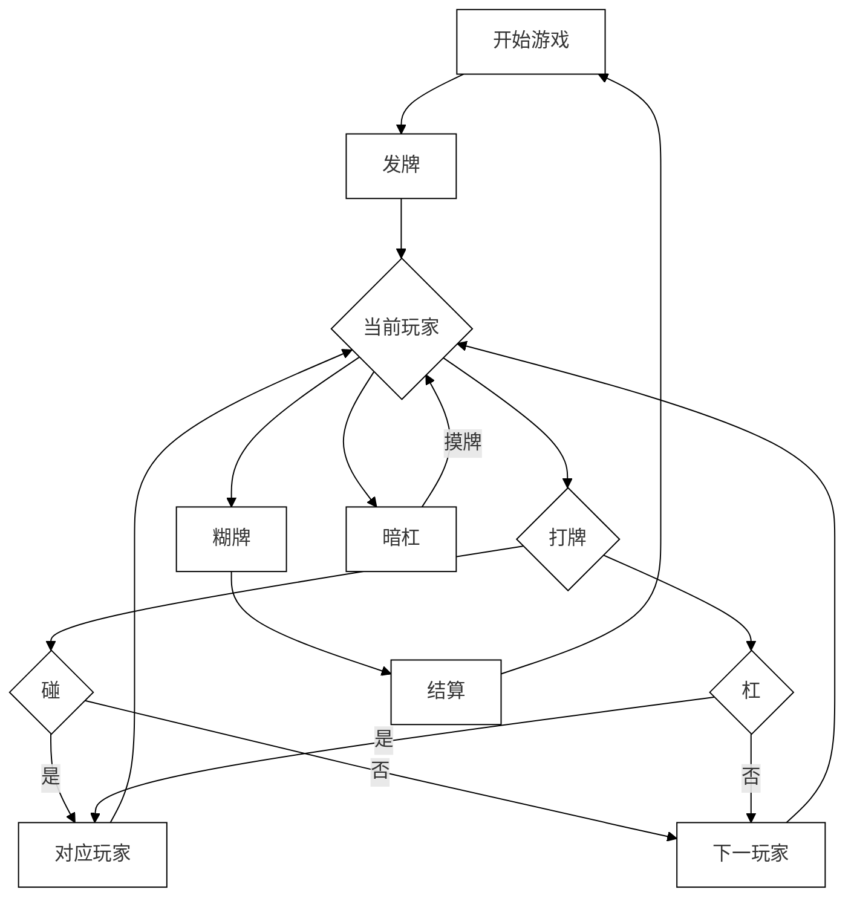

## 需要使用mermaid查看

```mermaid
graph TD
A[开始游戏]-->B[发牌]
B-->C{当前玩家}
C-->D[糊牌]
C-->E{打牌}
C-->F[暗杠]
F-->|摸牌|C
E-->G{碰}
E-->H{杠}
G-->|是|I[对应玩家]
G-->|否|J[下一玩家]
H-->|是|I[对应玩家]
H-->|否|J[下一玩家]
I-->C
J-->C
D-->K[结算]
K-->A

classDef rect fill:#ffffff,stroke:#000000,stroke-width:1px;
class A,B,C,D,E,F,G,H,I,J,K rect;
linkStyle 0 stroke:#000000,stroke-width:1px;
linkStyle 1 stroke:#000000,stroke-width:1px;
linkStyle 2 stroke:#000000,stroke-width:1px;
linkStyle 3 stroke:#000000,stroke-width:1px;
linkStyle 4 stroke:#000000,stroke-width:1px;
linkStyle 5 stroke:#000000,stroke-width:1px;
linkStyle 6 stroke:#000000,stroke-width:1px;
linkStyle 7 stroke:#000000,stroke-width:1px;
linkStyle 8 stroke:#000000,stroke-width:1px;
linkStyle 9 stroke:#000000,stroke-width:1px;
linkStyle 10 stroke:#000000,stroke-width:1px;
linkStyle 11 stroke:#000000,stroke-width:1px;
linkStyle 12 stroke:#000000,stroke-width:1px;
linkStyle 13 stroke:#000000,stroke-width:1px;
linkStyle 14 stroke:#000000,stroke-width:1px;
linkStyle 15 stroke:#000000,stroke-width:1px;
```